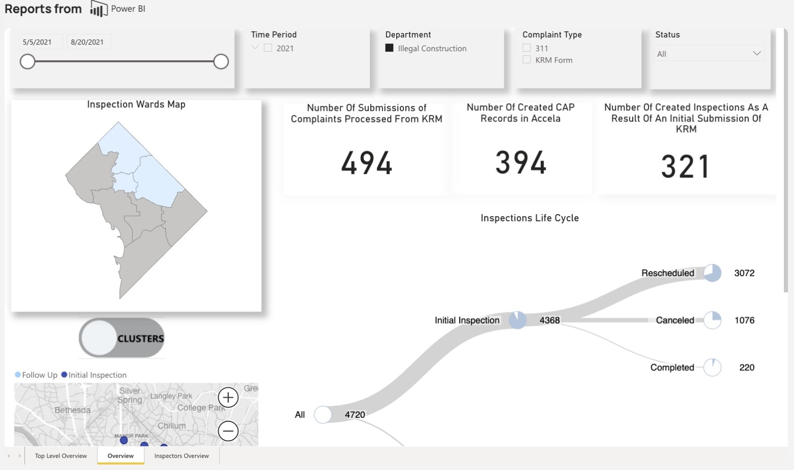
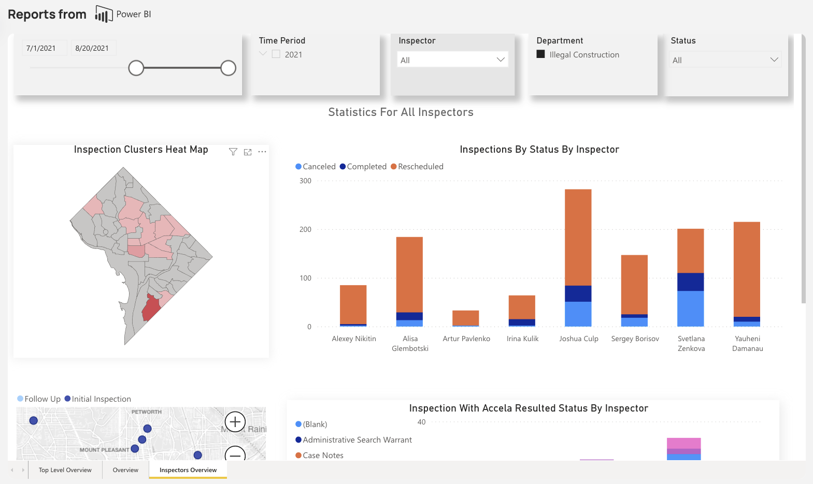

<section id="reports-page-new" markdown="1">

# Reports Page NEW
Reports aim to give historical and realtime metrics to understand the current health of each program within the Dispatch system.  Each tab gives the user different benchmarks to help look at the data in different ways. The Reports functionality is only avialable for users with the role of User Admin.

**Filters**
The filters below can applied per tab. Each tab can have different filters available for use.
* **Date Range** - The Date Range filter allows the user to specify an exact amount of time to review.
* **Year/Month** - The Year/Month filter allows the user to specify an exact year or month to review. 
* **Department** - The Department filter allows the user to review department specfic information. 
* **Complaint Type** - The Complaint Type filter allows the user to review data for specific complaint origins. 
* **Status** - The Status filter allows users to review data based on the status of an assignment.
* **Inspectors** - The Inspectors filter allows users to review data based on a specific inspector. 

## Overview Tab
The Overview tab outlines the highlest level view of the reports functionality, and serves as the landing page for at a glance inspection information. 

**Heat Map**
The heat map allows the user to see where the most assignments and least assignments are in DC. When a section is dark red (clusters) or blue (wards) the more assignments as the cluster gets less red/blue and more gray there are fewer assignments. The heat map can display the heat map data based on clusters or wards via the toggle below the map.

**Inspection Map**
The inspection map breaks down inspections across the map based on the type of inspection.  If there are multiple inspections of different types within the same address the inspection node will be displayed as a pie chart.  Each node/piechart can be hovered to display additional information about the inspection type. 

**Inspection Life Cycle**
The inspection life cylce shows the progression of each inspection from start to it's eventual outcome. The wider the line the more inspections in the path. 

IAMGE HERE

## Metrics Tab
The metrics tab allows users to review information about how the amount of inspections, unique inspections, and averages for how long inspections are taking from creation to result. 

{: data-lightbox="1-group"}
{: data-lightbox="1-group"}
{: data-lightbox="1-group"}
{: data-lightbox="1-group"}

</section>
